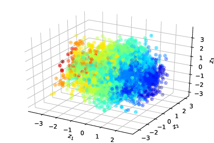
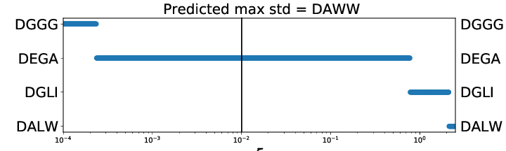

# Discovery of Self-Assembling pi-Conjugated Peptides by Active Learning-Directed Coarse-Grained Molecular Simulation
Code and notebooks to accompany "Discovery of Self-Assembling pi-Conjugated Peptides by Active Learning-Directed Coarse-Grained Molecular Simulation" (DOI: https://doi.org/10.1021/acs.jpcb.0c00708)

## Contents

### VAE

The [VAE](VAE) directory details the procedure for generating the VAE used for producing the latent space embeddings.

[VAE notebook](VAE/VAE.ipynb)

### Active Learning

The [ActiveLearning](ActiveLearning) directory contains details the steps involved for a single active learning iteration.

[GPR model selection notebook](ActiveLearning/step_1-GPR/Model_Selection_GPR.ipynb)

[Selecting candidates with AL](ActiveLearning/step_2-aquisition/Acquisition_sampling.ipynb)

